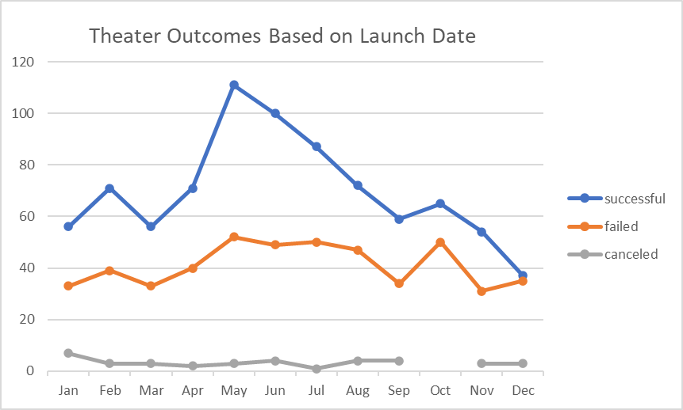
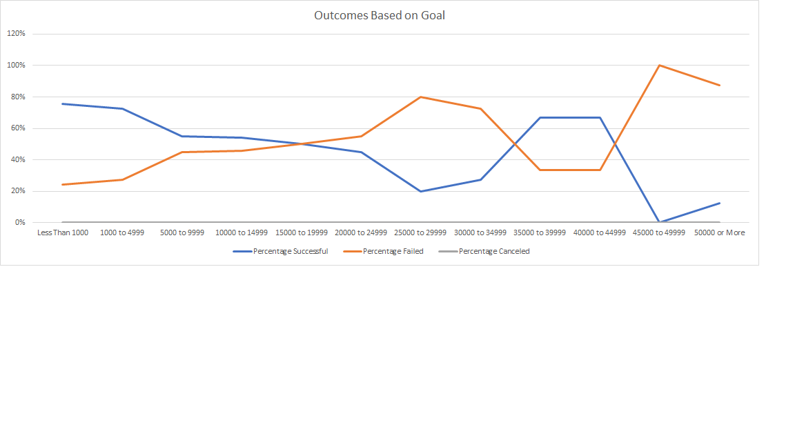

# Kickstarting with Excel

## Overview of Project
Analyze Kickstarter data using Excel to find trends, patterns, and various statistics.

### Purpose
Assist Louise by comparing her Kickstarter play, Fever, to the Kickstarter projects in the dataset. Help her find which dates and goals would be best for her project.

## Analysis and Challenges

### Analysis of Outcomes Based on Launch Date
There were more successful outcomes than failed outcomes each month except in December. The number of canceled projects stayed consistent throughout the year. The summer months seem to have the most projects launched.

### Analysis of Outcomes Based on Goals
The more expensive the goal, the less successful the outcome. Except for project goals between $35,000 to $44,999.

### Challenges and Difficulties Encountered
An incomplete dataset could be a possible challenge, it would skew the statistics even if outliers were removed. Converting multiple currencies to a single one for comparison.

## Results

- What are two conclusions you can draw about the Outcomes based on Launch Date?
  -Theater projects on Kickstarter were most successful between April and August with a peak in May. November and December were the least successful months for Theater projects.
- What can you conclude about the Outcomes based on Goals?
  -The most successful outcomes based on goal $ value amounts were $0 to $4,999 and $35,000 to $44,999. The least successful outcomes based on goal $ value were $25,000 to $29,999 and $45,000 to $49,999.
- What are some limitations of this dataset?
  -
- What are some other possible tables and/or graphs that we could create?
  -We could create pivot tables and graphs of the success of other Theater subcategories like musicals and spaces to compare to plays.
